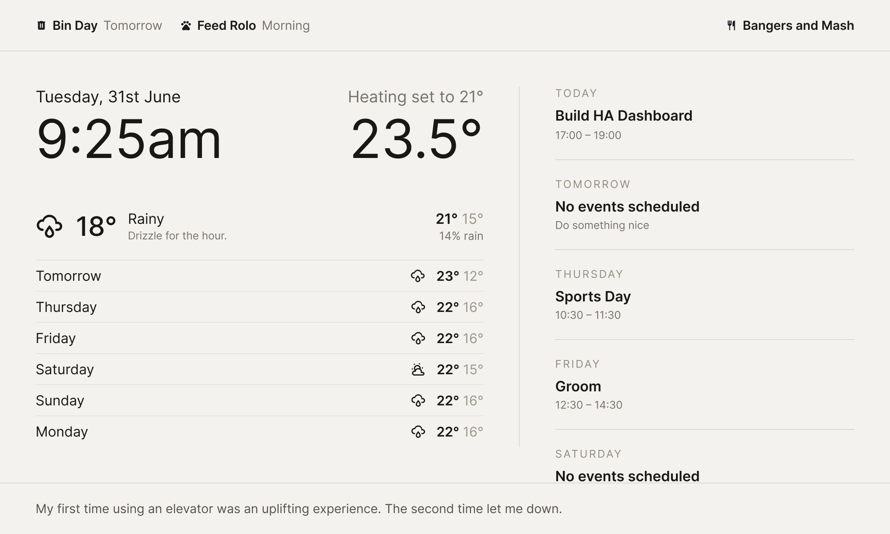

# Minimal Dashboard

A Home Assistant dashboard built for a 2000×1200 landscape tablet running
Fully Kiosk Browser. Talks to HA directly over the WebSocket API (live
entity state) and REST (calendar events); no Lovelace, no YAML dashboard
config, no shadow DOM digging when you want to change something. It's a
small React + TypeScript app you build and drop into HA's `www` folder.

Shows: current weather + tap-for-hourly forecast, a 7-day calendar agenda
merged from multiple calendars, a top alert bar (bin day, pet feeding and
treatment reminders, meal of the day), a garage door status banner, a
doorbell popover with a live camera snapshot, a rotating joke (double-tap
to fetch a new one), automatic dark mode at real sunset/sunrise, and a
second swipe-away page with two simple daily-habit trackers for kids
(reading streak + a behaviour checklist) backed by real HA helpers instead
of local storage.

Everything it reads is listed in one place — [src/config.ts](src/config.ts)
— and every entity is described below so you can wire up your own instance.



## 1. Create a long-lived access token

In Home Assistant: click your profile (bottom left) → **Security** tab →
scroll to **Long-lived access tokens** → **Create token**. Name it
something like `minimal-dashboard`, copy the token immediately — HA only
shows it once.

## 2. Configure the app

```bash
cp .env.example .env
```

Edit `.env`:

```
VITE_HA_URL=http://<your-ha-ip>:8123
VITE_HA_TOKEN=<the token from step 1>
```

Use the IP address rather than `homeassistant.local` if the tablet has ever
had trouble resolving `.local` hostnames on your network — Android WebViews
(which is what Fully Kiosk uses) are sometimes unreliable with mDNS.

## 3. Point the entity IDs at your own setup

Open [src/config.ts](src/config.ts) — every entity ID the dashboard reads
is listed there. Nothing else in the app needs to change once these match
your instance. Here's what each one is, what I personally use for it, and
how to get your own version working:

| Config key | Entity | What it needs |
| --- | --- | --- |
| `ENTITIES.sun` | `sun.sun` | Home Assistant's own built-in sun entity — always available, no setup. Drives the automatic dark-mode switch (see below). |
| `ENTITIES.weather` | a `weather.*` entity | Any weather integration that supports `weather.get_forecasts` (daily + hourly). I use [Pirate Weather](https://github.com/Pirate-Weather/pirateweather-ha) — Met.no and OpenWeatherMap work the same way. |
| `ENTITIES.minutelySummary` | any `sensor.*` | Optional — a short text string shown under the current condition (e.g. "Drizzle starting in 20 min"). I use Pirate Weather's minutely-summary sensor for this; skip it or point it at any sensor whose state is a short string. |
| `ENTITIES.climate` | a `climate.*` entity | I use [Tado](https://www.home-assistant.io/integrations/tado/) — reads `attributes.current_temperature`, so any thermostat integration works the same way. |
| `ENTITIES.targetTemperature` | an `input_number.*` | Whatever you use to show/set your target temperature. |
| `ENTITIES.recyclingBin` | any `sensor.*` | I use the [UK Bin Collection Data](https://github.com/robbrad/UKBinCollectionData) HACS integration, which exposes `attributes.next_collection` as an ISO date — that's read first, falling back to a `days`/`daysUntilCollection` attribute, then to looking for "today"/"tomorrow"/"in N days" in the state text, so most other bin-collection integrations should work too. |
| `ENTITIES.dadJoke` | any `sensor.*` | State is shown at the bottom of the screen — double-tap it to force an immediate refetch rather than waiting for the sensor's normal poll interval. I use a REST sensor hitting the free [icanhazdadjoke.com](https://icanhazdadjoke.com) API — see example below. |
| `ENTITIES.garageDoor` | a `cover.*` entity | I use a [Shelly](https://www.home-assistant.io/integrations/shelly/) relay wired into the garage door motor, exposed as a cover entity — any cover entity works the same way. The banner reacts to `open`/`opening`/`closing`/`unknown` states and calls the generic `cover.toggle` service when tapped. |
| `ENTITIES.mealSchedule` | a `calendar.*` entity | I keep a dedicated "Meals" calendar in Google Calendar, synced into HA via the built-in Google Calendar integration, and use its all-day event title as today's meal. Any calendar entity works the same way — shows today's event (via `attributes.message` if present, else the event summary) in the top-right corner. |
| `ENTITIES.frontDoorDing` / `frontDoorCamera` | `binary_sensor.*` / `camera.*` | Optional doorbell popover — see [Set up the doorbell alert](#5-set-up-the-doorbell-alert-optional) below. |
| `ENTITIES.petAFedMorning` / `petAFedEvening` | `input_boolean.*` | Optional pet feeding reminders — each shows as a top-bar alert when `off`, and needs two taps to dismiss (turns to `on`) so a stray tap can't mark it done by mistake. Add/remove/rename these to match how many pets (if any) you actually have — see [AlertsBar.tsx](src/components/AlertsBar.tsx). |
| `PET_TREATMENTS` | `input_boolean.*` | Optional flea/worming treatment reminders — see [Set up pet treatments](#6-set-up-pet-treatments-optional) below. |
| `AGENDA_CALENDARS` | `calendar.*` entities | Every calendar listed here gets merged into one agenda list in the right-hand column — I merge everyone's personal Google Calendars plus a shared household one. Add as many as you like. Optionally add entries to `AGENDA_CALENDAR_LABELS` to prefix a given calendar's events with a name (e.g. "Person A - Dentist"). |

### Example REST sensor for the joke

```yaml
sensor:
  - platform: rest
    name: Dad Joke
    resource: https://icanhazdadjoke.com/
    headers:
      Accept: text/plain
    value_template: "{{ value }}"
    scan_interval: 3600
```

## 4. Set up the kids' charts (optional)

The second swipe page is two independent daily-habit trackers — a reading
streak (star grid, resets every 7 days, big milestone every 28) and a
behaviour checklist (a day only counts once every item on the list is
checked). Both are entirely optional; if you don't want this page, remove
the second `<KidsPage />` slide in [App.tsx](src/App.tsx) and drop the
`swipe-*` CSS down to a single page.

Leaving the page parked open doesn't stick — it auto-returns to the main
dashboard after 5 minutes of no interaction (see `IDLE_RETURN_MS` in
[useSwipePage.ts](src/hooks/useSwipePage.ts)).

If you do want it, add these helpers to `configuration.yaml` (restart HA
afterwards — `counter`/`input_datetime` helpers only load on restart, not
a config reload):

```yaml
counter:
  kids_reading_days:
    name: Kids Reading Days
    initial: 0
    step: 1
  kids_behaviour_days:
    name: Kids Behaviour Days
    initial: 0
    step: 1

input_datetime:
  kids_reading_last_day:
    name: Kids Reading Last Day
    has_date: true
    has_time: false
  kids_behaviour_last_completed_day:
    name: Kids Behaviour Last Completed Day
    has_date: true
    has_time: false

  # One per behaviour category — must match src/config.ts's
  # BEHAVIOUR_CATEGORIES exactly (input_datetime.kids_behaviour_<slug>_last_marked).
  # Add/remove pairs here and in that file together if you change the categories.
  kids_behaviour_kind_words_last_marked:
    name: Kids Behaviour Kind Words Last Marked
    has_date: true
    has_time: false
  kids_behaviour_listening_last_marked:
    name: Kids Behaviour Listening Last Marked
    has_date: true
    has_time: false
  kids_behaviour_tidy_last_marked:
    name: Kids Behaviour Tidy Last Marked
    has_date: true
    has_time: false
  kids_behaviour_brushing_teeth_last_marked:
    name: Kids Behaviour Brushing Teeth Last Marked
    has_date: true
    has_time: false
```

Safe to inspect/reset any of these any time from **Developer Tools →
States** — e.g. set a counter back to `0` there if you want to start over.

## 5. Set up the doorbell alert (optional)

If `ENTITIES.frontDoorDing` (a `binary_sensor`) turns `on`, a popover slides
over the whole screen (inset 80px on every side, not truly fullscreen)
showing the live snapshot from `ENTITIES.frontDoorCamera`, and stays up for
a full 60 seconds regardless of how quickly the sensor itself flips back to
`off` — the press is momentary, a family actually walking to the door isn't.
Tap anywhere, or the × in the corner, to dismiss it early.

No helpers needed — just point both entities at whatever doorbell
integration and camera you already have. If you don't have a doorbell,
leave `frontDoorDing` pointing at any `binary_sensor` that never turns on
and the popover simply never appears.

## 6. Set up pet treatments (optional)

Separate from the feeding reminders above — flea and worming treatments,
tracked purely by calendar month, with **no automation required**. Each
treatment in `PET_TREATMENTS` (in [src/config.ts](src/config.ts)) is an
`input_boolean` — `on` means done, `off` means due, same convention as the
feeding reminders — plus a `dueMonths` list saying which calendar months it
should be due in (e.g. flea every month, worming quarterly).

The trick: nothing ever resets these on a timer. Instead, every time the
app notices it's a due month and the boolean is still `on`, it checks that
boolean's own `last_changed` timestamp (something HA already tracks on
every entity for free) against the start of the current month. If it was
last changed *before* this month started, that's a stale "done" left over
from the previous cycle, and the app turns it back `off` itself — due
again. If it was changed *this* month, it's genuinely already done, and
gets left alone. See [usePetTreatments.ts](src/ha/usePetTreatments.ts).

Because it's a plain boolean, correcting one by hand in HA (Developer Tools
→ States, or Settings → Devices & services → Helpers) always works exactly
as expected — there's no separate automation state to fight with.

Tapping a due alert on the dashboard needs two taps within a second to
confirm (the first just dims the chip briefly) — the same
double-tap-to-confirm pattern used for the feeding reminders, so a stray
touch can't mark a treatment done by accident.

Add the helpers to `configuration.yaml` and restart HA:

```yaml
input_boolean:
  pet_a_flea_tablet:
    name: Pet A Flea Tablet
    icon: mdi:pill
  pet_a_worming_tablet:
    name: Pet A Worming Tablet
    icon: mdi:medication
  pet_b_flea_tablet:
    name: Pet B Flea Tablet
    icon: mdi:pill
  pet_b_worming_tablet:
    name: Pet B Worming Tablet
    icon: mdi:medication
```

Leave each one `on` initially if it's not currently due, `off` if it is —
from then on the app manages the resets itself.

## 7. Run it locally to check it against real data

```bash
npm install
npm run dev
```

Open the printed `localhost` URL — you should see your actual alerts,
weather, heating, and calendar (restart `npm run dev` after editing `.env`,
Vite only reads it at startup).

## 8. Build it

```bash
npm run build
```

This produces a `dist/` folder — a handful of static HTML/JS/CSS files.
That's the entire deployable app.

## 9. Deploy it into Home Assistant

The simplest option: put it in HA's own `www` folder, so it's served from
the same origin as HA itself (this matters — it avoids CORS entirely,
since the dashboard's REST calendar requests and WebSocket connection are
then same-origin).

Via SSH/Samba into your HA config directory:

```bash
mkdir -p /config/www/minimal-dashboard
# copy the *contents* of dist/ (not the dist folder itself) into /config/www/minimal-dashboard/
```

That's why `vite.config.ts` has `base: '/local/minimal-dashboard/'` baked
in for production builds — HA serves anything in `/config/www/` at
`/local/`, so the built asset paths need to match that prefix or the JS/CSS
won't load. If you rename the folder, update `base` in `vite.config.ts` to
match and rebuild.

No HA restart needed — `/config/www/` is served live.

## 10. Point Fully Kiosk at it

In Fully Kiosk Browser's settings, change the **Start URL** to:

```
http://<your-ha-ip>:8123/local/minimal-dashboard/index.html
```

Fullscreen, no navigation bar — same kiosk settings as any other
start-URL change.

## Updating it later

Any time you change something: `npm run build`, then copy the new `dist/`
contents over the old ones in `/config/www/minimal-dashboard/`, then reload
the page on the tablet.

## If calendar events or alerts don't show up

Alerts that toggle (pet reminders) call `<domain>.toggle` over the
websocket connection, which only needs the token from step 1 — no extra
config. If calendar events don't show up, check the browser console
(`Fully Kiosk → Settings → Web content → enable remote debugging`, or just
test in a desktop browser first) for a 401/403 from `/api/calendars/...`,
which usually means the token was pasted wrong or has since been revoked.

## Dark mode

Automatic, no setup beyond `ENTITIES.sun` (which needs nothing — it's
built into every HA instance). The whole dashboard is built on a handful of
CSS variables (`--paper`, `--ink`, `--muted-*`, `--hairline*`), so flipping
them all at once when `sun.sun` reports `below_horizon` is enough to invert
the entire UI — dark background, light text — with a 1-second crossfade
rather than a hard cut. See `body.dark-mode` in
[src/index.css](src/index.css).

## Design notes

Built for a fixed 2000×1200 resolution rather than being responsive — the
whole point was a wall-mounted tablet with one known screen size, so
`vh`/`vw` units mostly gave way to fixed pixel values, and the type scale
is constrained to five sizes (see the `--fs-*` variables at the top of
[src/index.css](src/index.css)).

## Changelog

Recent additions, roughly newest first:

- **Automatic dark mode** — flips the whole UI at real sunset/sunrise using HA's `sun.sun` entity, with a smooth crossfade.
- **Doorbell popover** — a live camera snapshot shown for a full minute when a doorbell `binary_sensor` fires.
- **Pet treatment tracking** — flea/worming reminders on independent monthly/quarterly schedules, calendar-driven with no automation needed.
- **Double-tap-to-confirm** — feeding and treatment alerts now need two taps in quick succession to dismiss, so a stray touch can't mark something done by accident.
- **Joke double-tap refresh** — tap the joke bar twice to force an immediate refetch instead of waiting for its normal poll interval.
- **Calendar name prefixes** — agenda events can be prefixed with a person's name (`AGENDA_CALENDAR_LABELS`) so it's clear at a glance whose event it is, without double-prefixing calendars that already do this themselves.
- **Kids' charts auto-return** — the second swipe page automatically returns to the main dashboard after 5 minutes of no interaction, so it doesn't get left stuck open.
- **Infinite-loop swipe** — swiping past either end of the two-page carousel wraps around smoothly instead of stopping dead.
- **Hourly forecast modal** — tap the current-weather row for a scrollable hour-by-hour breakdown.
